```{r setup, include=FALSE}
knitr::opts_chunk$set(echo = FALSE)
```
# Uvod

Namen aplikacije Špička je racionalizacija elektronskega oddajanja poročil o delu od doma za zaposlene na Umarju. 

Špička je dostopna preko brskalnika na povezavi [http://spicka.umar.local:3838](http://spicka.umar.local:3838) - oz. od doma morate (zaenkrat) [http://192.168.38.21:3838](http://192.168.38.21:3838)

**Deluje samo, če si prijavljen v HKOM**.

# Prijava

Uporabniško ime je sestavljeno iz prve črke imena in (prvega dela) priimka  brez čšž-jev npr. `mzaloznik`.^[Če hočeš drugačno uporabniško ime, pridi do Maje Z. in se zmenimo.]

Geslo je privzeto nastavljeno na 123 in **po prvi prijavi je priporočljivo, da si ga spremeniš**. 

```{r, fig.cap="Prijava", out.width="80%", fig.align="center", fig.pos="H"}
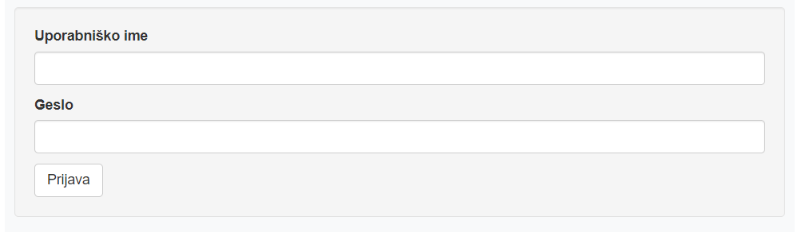
```

\newpage
# Nov vnos

Za nov vnos najprej na koledarju izberi datum, za katerega želiš vnesti poročilo.

```{r, fig.cap="Izbira datuma", out.width="50%", fig.align="center", fig.pos="H"}
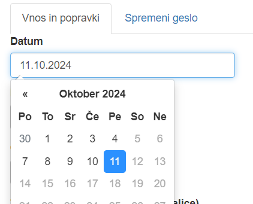
```

## Obvezna polja

Obvezen je vnos prihoda in odhoda na delo ter poročila o opravljenih nalogah. 

Po pravilnem vnosu prihoda in odhoda se avtomatično prikaže izračun skupne prisotnosti. Pri tem barva podlage označuje, ali je prisotnost enaka X-urnemu delavniku na tvoji pogodbi, ali je večja ali manjša. V spodnjem primeru je večja:

```{r, fig.cap="Pravilen vnos prisotnosti", out.width="80%", fig.align="center", fig.pos="H"}
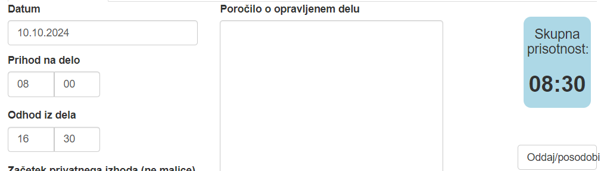
```

Vnesti je mogoče tudi prihod ali odhod zunaj dovoljenega časa, kar pomeni, da je šlo za predčasni prihod/odhod. V tem primeru se bo opozorilno obarvalo ozadje. Tak vnos je še vedno mogoče oddati, opozorilna barva je namenjena preprečevanju napak in pa kot opozorilo, da moraš oddati ustrezno vlogo v Špici in to tudi napisati v opombe. 

```{r, fig.cap="Prihod/odhod zunaj dovoljenega časa", out.width="40%", fig.align="center", fig.pos="H"}
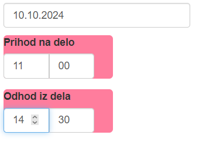
```

Poročilo o opravljenem delu vneseš v veliko polje na sredini. To so vsa obvezna polja za običajen vnos in zdaj že lahko klikneš na gumb `Oddaj/posodobi` na desni strani. Aplikacija te bo opozorila, če je karkoli narobe. 

```{r, fig.cap="Vnos opravljenih nalog", out.width="95%", fig.align="center", fig.pos="H"}
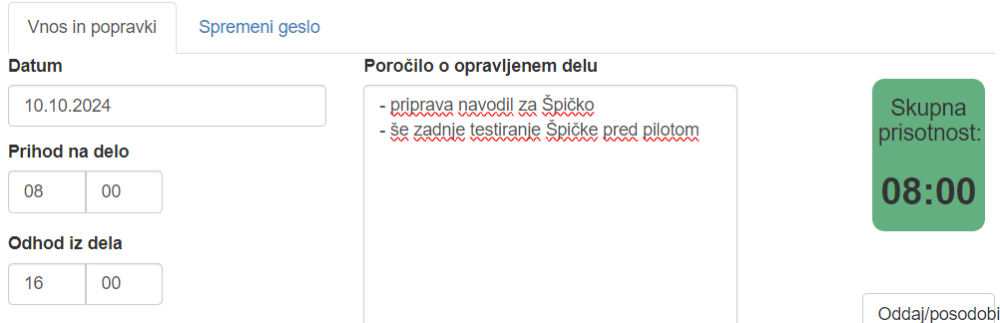
```

## Dodatna polja

`Začetek` in `konec privatnega izhoda` sta polji, namenjeni izhodu, ki ni odmor za malico in se torej odšteje od skupne prisotnosti. Vnešene ure morajo seveda biti znotraj prihoda in odhoda na delo. 

`Dodatne opombe za špico` je polje, kamor napišeš, če so bile potrebne tudi kakšne dodatne vloge v Špici npr. če gre za delo od doma po urah, če si oddal vlogo za predčasni odhod ali kaj podobnega.

`Odmor med delovnim časom (malica)` in `Obseg izrabe odmora` sta avtomatično izpolnjeni polji. Če želiš, lahko čas tega odmora tudi skrajšaš ali celo zbrišeš kljukico, *ampak to ne vpliva na izračun skupne prisotnosti*. 


```{r, fig.cap="Dodatna polja", out.width="95%", fig.align="center", fig.pos="H"}
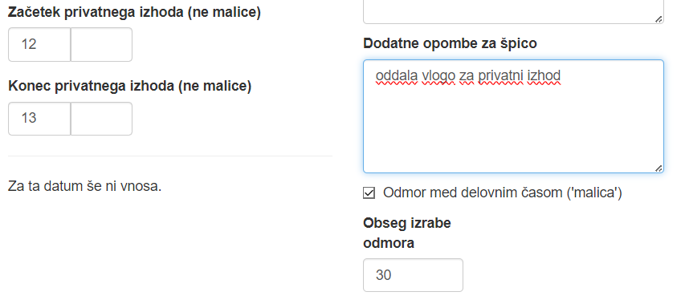
```

\newpage
# Popravljanje obstoječega vnosa

Če se pri oddaji poročila zmotiš, lako obstoječi vnos tudi popraviš. 


**Popravke delaj samo za tekoči teden. Če moraš izjemoma kaj popraviti kasneje, ko je že bilo pripravljeno tedensko poročilo za vnos v Špico, nemudoma sporoči na `spica.umar@gov.si`, sicer popravki ne bodo upoštevani.**

**V bazi bodo shranjeni vsi vnosi, da je zagotovljena sledljivost sprememb in se vidi tudi, kdaj so bili popravki narejeni.**

Spremembo narediš tako, da v koledarju izbereš datum, ki ga želiš spremeniti. Forma se bo izpolnila z vrednostmi, ki si jih nazadnje vnesel. Spodaj bo vidna tudi zgodovina sprememb.

```{r, fig.cap="Zgodovina sprememb", out.width="45%", fig.align="center", fig.pos="H"}
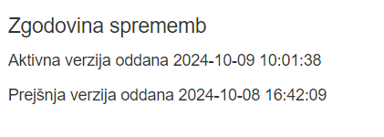
```


Vnos posodobiš podobno, kot delaš nov vnos: izpolniš oz. popraviš ustrezna polja in klikneš na gumb `Oddaj/posodobi`. Tokrat te bo Špička opozorila, da popravljaš obstoječ vnos, in vprašala, ali si res prepričan. 

```{r, fig.cap="Posodobitev vnosa", out.width="80%", fig.align="center", fig.pos="H"}
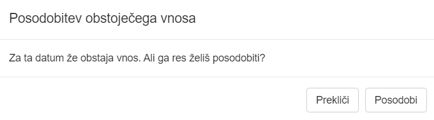
```

# Brisanje vnosa

Možno je tudi brisanje vnosa - npr. v primeru, da si vnesel podatke za napačen datum. V tem primeru se spet s pomočjo koledarja postavi na vnos, ki ga želiš zbrisati in klikni na gumb spodaj desno `Izbriši vnos`. Aplikacija te bo še enkrat vprašala, če si prepričan. 

Brisanje vnosa pomeni, da za ta datum ni več aktivnega vnosa, torej se v poročilih ne bo pojavil, toda na bazi bo vedno shranjena celotna zgodovina popravkov in brisanj. 

```{r, fig.cap="Brisanje vnosa", out.width="45%", fig.align="center", fig.pos="H"}
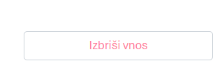
```

# Spreminjanje gesla

Na drugem zavihku imaš polja za spremembo gesla.^[Če slučajno pozabiš novo geslo, pridi do Maje Z., pa se zmenimo..]


```{r, fig.cap="Sprememba gesla", out.width="40%", fig.align="center", fig.pos="H"}
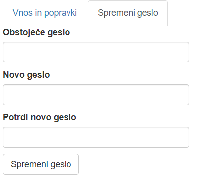
```

# Priprava poročila

Na tretjem zavihku imaš možnost priprave poročila za izbrano obdobje. Vsak zaposleni lahko pripravi poročilo za svoje vnose, vodje sektorjev in administratorji pa lahko pripravijo tudi posebna poročila za svoj sektor oz. za vnos v Špico.

```{r, fig.cap="Priprava poročila", out.width="40%", fig.align="center", fig.pos="H"}
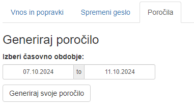
```

Pripravljeno pdf poročilo se odpre v brskalniku. **Ob pripravi poročila bo brskalnik verjetno blokiral pop-up, zato ga moraš izrecno dovoliti.** To je treba narediti samo enkrat, potem se bo poročilo samodejno odprlo. 


```{r, fig.cap="Odprava blokade", out.width="40%", fig.align="center", fig.pos="H"}
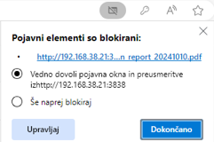
```